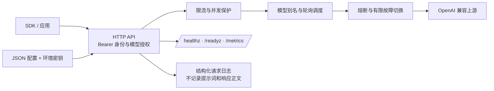

# AI Gateway

一个面向生产落地的 AI 网关 MVP：提供 OpenAI 兼容入口，集中处理客户端身份、模型白名单、RPM 限流、并发保护、模型别名、多部署轮询、故障切换、熔断、流式转发和基础指标。

当前 MVP 使用静态 JSON 配置和单进程内存状态，目的是先稳定一条模型请求链路。它保留了后续接入 Redis、配置控制面、成本账本和策略审计的边界。

## 架构



## 已实现

- `POST /v1/chat/completions`：OpenAI Chat Completions 请求格式，支持非流式和 SSE 流式响应。
- `GET /v1/models`：按客户端权限返回可用模型别名。
- `GET /healthz` 和 `GET /readyz`：容器探针。
- `GET /metrics`：可选 Bearer 保护的 Prometheus 文本指标；不配置 token 时返回 404。
- 多客户端密钥、模型白名单、客户端 RPM 和全局并发上限。
- 模型别名映射到多个 OpenAI 兼容部署，按轮询起点分配；上游连接错误、429 和 5xx 可有限切换。
- 熔断器、请求体上限、上游超时、优雅关停、请求 ID 和结构化日志。
- API 密钥只从环境变量读取；日志不包含提示词或响应正文。

## 快速开始

需要 Go 1.22 或更新版本。复制示例配置后设置环境变量：

```sh
export AI_GATEWAY_CLIENT_KEY="$(openssl rand -hex 32)"
export AI_GATEWAY_METRICS_TOKEN="$(openssl rand -hex 32)"
export OPENAI_API_KEY="<your-provider-key>"
export BACKUP_API_KEY="<your-compatible-provider-key>"
cp configs/gateway.example.json configs/gateway.json
go run ./cmd/gateway -config configs/gateway.json
```

将配置中的 `compatible-backup` 地址和模型替换为实际 OpenAI 兼容服务；如果暂时没有备用部署，可从该模型的 `deployments` 中移除它。不要把真实密钥写入配置文件或提交到 Git。

调用示例：

```sh
curl http://localhost:8080/v1/chat/completions \
  -H "Authorization: Bearer $AI_GATEWAY_CLIENT_KEY" \
  -H "Content-Type: application/json" \
  -d '{"model":"fast","messages":[{"role":"user","content":"你好"}],"stream":false}'
```

流式请求只需设置 `"stream": true`。网关会透传上游 SSE；开始向客户端写出响应后不会再尝试切换上游。

## 配置模型

`configs/gateway.example.json` 包含三个静态对象：

- `clients`：调用方 ID、密钥环境变量、允许使用的模型别名和每分钟请求数。
- `providers`：OpenAI 兼容服务的基础 URL、上游模型名和 API 密钥环境变量。
- `models`：客户端可见的别名及部署顺序。

非 429 的上游 4xx 会直接返回给客户端，避免因输入错误静默切换模型。上游 429 和 5xx、网络错误可以切换到下一部署，单个请求最多尝试 `retry_max_attempts` 个部署。

## 生产部署边界

这个版本适合先以单实例、受控流量部署并验证兼容性。扩大流量前应完成以下工作：

1. 把客户端 RPM 限流替换成 Redis 等共享原子限流器，并增加 TPM / 预算预留与实际用量核对。目前的 RPM 桶和熔断器是进程内状态，多副本之间不共享。
2. 将静态 JSON 配置迁移到受 RBAC 保护的控制面或受版本管理的配置发布流程；密钥放入 Secret Manager / Kubernetes Secret。
3. 配置 Prometheus 抓取、告警、日志保留和区域出口策略。`/metrics` 应只在内网暴露，并配置独立 token。
4. 根据供应商能力建立适配器矩阵。当前只支持 OpenAI Chat Completions 兼容协议；不支持 Anthropic 原生 Messages、Responses API、工具协议适配、音视频或语义缓存。
5. 为回退策略指定语义兼容的模型，确认区域、数据分类、输出质量和费用约束；上游价格未配置，因此此版本不计算账单金额。
6. 根据业务设定 SLO，并在发布前验证负载、断连、429、超时、上游故障和进程关停场景。

默认服务不提供 TLS 终止，生产环境应部署在受控的反向代理或负载均衡器之后。网络出口应限制为配置中的上游主机；配置文件属于管理员信任边界。

## 运行

```sh
go build ./cmd/gateway
go run ./cmd/gateway -config configs/gateway.json
```
